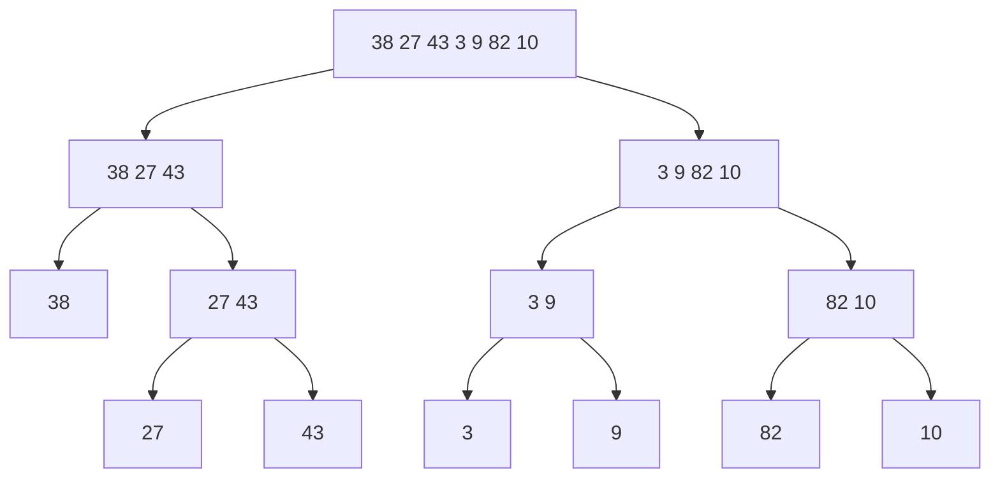

# Merge Sort

## Overview
Merge Sort is an efficient divide-and-conquer sorting algorithm that splits the array into smaller halves, sorts them recursively, and then merges them back together.

## Quick Facts
- Category: Sorting Algorithm
- Difficulty: Intermediate
- Stable: Yes
- In-place: No
- Comparison Based: Yes
- Recursive: Yes

## Intuition
Break the problem into smaller pieces until each piece has one element. Then merge the smaller sorted pieces step by step to form the final sorted array.

## How It Works
1. Divide the array into two halves
2. Recursively sort both halves
3. Merge the two sorted halves
4. Repeat until the full array is sorted

## Visual Explanation

Example: `[38, 27, 43, 3, 9, 82, 10]`

## Algorithm
Divide the array into smaller halves
Recursively sort both halves
Merge sorted halves carefully
Complexity Analysis

## Case	Time Complexity
Best	O(n log n)
Average	O(n log n)
Worst	O(n log n)
Space Complexity

O(n)