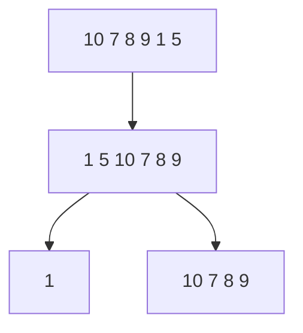

# Quick Sort

## Overview
Quick Sort is a fast divide-and-conquer sorting algorithm that selects a pivot element and partitions the array so that smaller elements come before the pivot and larger elements come after it.

## Quick Facts
- Category: Sorting Algorithm
- Difficulty: Intermediate
- Stable: No
- In-place: Yes
- Comparison Based: Yes
- Recursive: Yes

## Intuition
Choose one element as the pivot. Put all smaller elements on the left side and all larger elements on the right side. Then repeat the same process on both parts.

## How It Works
1. Choose a pivot element
2. Partition the array around the pivot
3. Recursively apply Quick Sort on left part
4. Recursively apply Quick Sort on right part

## Visual Explanation

Example: `[10, 7, 8, 9, 1, 5]`

Choose pivot = `5`

## Example

Input:
[10, 7, 8, 9, 1, 5]

Output:
[1, 5, 7, 8, 9, 10]

Dry Run

Initial array:
[10, 7, 8, 9, 1, 5]

Using last element as pivot:

Pivot = 5
Partition array
After partition: [1, 5, 8, 9, 10, 7]
Pivot 5 is now in correct position

Sort left side:

[1] already sorted

Sort right side:

[8, 9, 10, 7]
Pivot = 7
Partition → [7, 9, 10, 8]
Continue recursively until fully sorted

Final sorted array:
[1, 5, 7, 8, 9, 10]

## Algorithm
Choose a pivot
Partition array around pivot
Recursively sort left and right subarrays

## Complexity Analysis
Case	Time Complexity
Best	O(n log n)
Average	O(n log n)
Worst	O(n²)
Space Complexity

 ## O(log n) for recursion stack on average

## dvantages
Very fast in practice
In-place sorting
Widely used conceptually
Disadvantages
Worst-case O(n²)
Not stable
Performance depends on pivot choice
When to Use
For fast general-purpose sorting
When in-place sorting is preferred
When average-case performance matters
